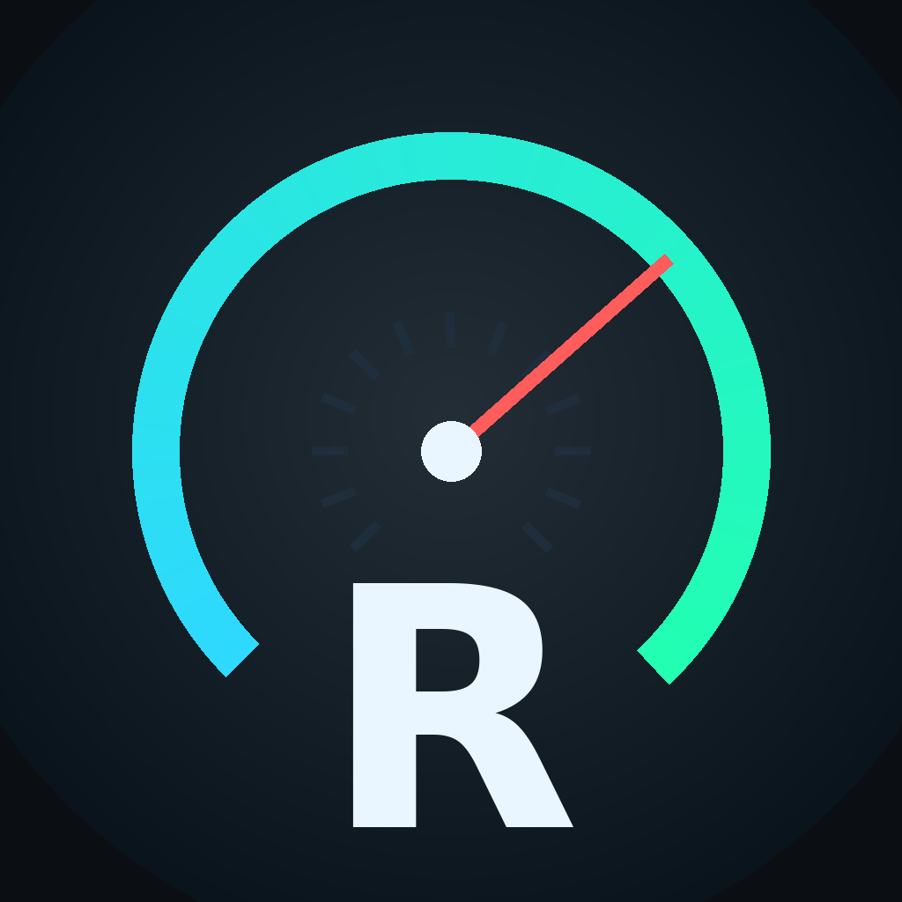

# RevIQ ⚡🚗

**A smart driving companion for iOS 16+** — connects to any **ELM327 Bluetooth (BLE)** OBD-II adapter, coaches you to drive more efficiently in three modes (**ECO / NORMAL / SPORT**), scores your driving, estimates fuel use, tracks maintenance, reads engine fault codes, and writes AI reports.



---

## ✨ Features

| Area | What you get |
|---|---|
| **Live dashboard** | Racing-HUD speedometer, RPM shift-light bar, throttle/load/temps/battery/fuel-level tiles, live 60-second spark charts |
| **3 driving modes** | ECO (strict economy coaching), NORMAL (balanced), SPORT (shift lights, 0–60 mph / 0–100 km/h auto timers, power estimate) |
| **Eco scoring** | Real-time 0–100 score built from efficiency (MAF vs. ideal curve), smoothness (jerk), anticipation (braking events), idle share and speed discipline — weighted per mode |
| **Offline coach** | Rule-based tips with cooldowns: harsh throttle, late braking, high revs at low speed, long idle, cold engine, aero-drag zone, positive coasting feedback |
| **AI copilot (hybrid)** | Bring-your-own **OpenAI-compatible endpoint** (OpenAI, Groq, OpenRouter, Ollama, LM Studio…): conversational coach with live car context, weekly written reports, DTC explanations |
| **Analytics** | Score-per-trip & consumption-per-trip charts, idle share, fuel saved vs. your aggressive baseline, CO₂ avoided, coach insights |
| **Trip journal** | Auto-recorded trips with per-trip detail charts (speed / RPM / throttle), AI analyst notes, PDF export |
| **Diagnostics** | Mode $03 fault-code reader, SAE-generic code database, AI diagnosis, Mode $04 clearing |
| **Maintenance** | Odometer-based service tracker (oil, filters, plugs, fluids…) with a manually maintained vehicle odometer |
| **Demo mode** | A full simulated ELM327 + car physics, so you can explore everything without hardware |
| **Reports** | Shareable PDFs for the whole history or a single trip |

All data stays **on-device** (JSON in the app's Documents folder). The AI key is stored in UserDefaults and sent only to the endpoint you configure.

---

## 🧱 Project structure

```
RevIQ/
├── project.yml                  # XcodeGen manifest (generates RevIQ.xcodeproj)
├── .github/workflows/build-ipa.yml
├── RevIQ/
│   ├── Sources/
│   │   ├── App/                 # App entry, theme, settings
│   │   ├── Models/              # Modes, trips, samples, maintenance, DTC models
│   │   ├── OBD/                 # ELM327 BLE transport, PID table + parser,
│   │   │                        # DTC database, demo simulator
│   │   ├── Engine/              # Polling session, scoring, fuel math,
│   │   │                        # offline coach, perf timers
│   │   ├── LLM/                 # OpenAI-compatible client + prompts + context
│   │   ├── Persistence/         # JSON store + PDF exporter
│   │   └── Views/               # Dashboard, Coach, Analytics, Garage, components
│   ├── Resources/Assets.xcassets
│   └── Support/                 # Info.plist generated here by XcodeGen
└── README.md
```

**Zero third-party dependencies.** Only system frameworks: SwiftUI, CoreBluetooth, Charts, UIKit. That keeps CI builds fast and reproducible.

---

## 🛠 Build locally

Requirements: macOS with Xcode 15+ and [XcodeGen](https://github.com/yonaskolb/XcodeGen) (`brew install xcodegen`).

```bash
git clone <your-fork> && cd RevIQ
xcodegen generate          # creates RevIQ.xcodeproj
open RevIQ.xcodeproj
# Select the RevIQ scheme, an iOS 16+ simulator → Run
```

Try the app instantly with **Garage → Demo car** (planted fault codes included: P0171 + P0420).

---

## 🤖 GitHub Actions → unsigned IPA

`.github/workflows/build-ipa.yml` runs on `push` to main/master (and manually via *Run workflow*):

1. Installs XcodeGen on a `macos-14` runner
2. Generates the Xcode project
3. Archives with `CODE_SIGNING_ALLOWED=NO` for generic iOS
4. Packages `Payload/RevIQ.app` → **`RevIQ-unsigned.ipa`**
5. Uploads the IPA as a workflow **artifact**

Download it from the run's *Artifacts* section.

### Installing an unsigned IPA

An unsigned IPA has no provisioning — pick one:

| Method | Notes |
|---|---|
| **AltStore / SideStore** | Sideloads and re-signs with your Apple ID (free 7-day) |
| **Sideloadly** | Same idea, desktop tool |
| **Xcode (free)** | `xcodegen generate`, set your Personal Team in Signing, Run on device |
| **TrollStore** | Installs unsigned IPAs directly on compatible iOS versions |
| **Enterprise / dev cert** | Sign with `codesign` + a provisioning profile |

> The workflow intentionally builds **unsigned** so you stay in control of signing.

---

## 🔌 Pairing your ELM327 BLE adapter

1. Plug the adapter into the car's OBD-II port, ignition ON (engine running is best).
2. RevIQ scans automatically for adapters advertising names like **OBDII, ELM327, V-Link, Vgate iCar, VEEPEAK, OBDLINK, KONNWEI, ANCEL** or serial services **FFE0 / FFF0 / 18F0**.
3. If nothing appears: pair the adapter once in **iOS Settings → Bluetooth**, then rescan in RevIQ.
4. The app runs the standard init (`ATZ`, echo off, headers off, protocol auto `ATSP0`) and polls ~6 fast PIDs per cycle + slow PIDs interleaved:

`010D speed · 010C RPM · 0110 MAF · 0111 throttle · 0104 load · 010B MAP · 0105 coolant · 010F intake · 012F fuel level · 010E timing · 0106/07 fuel trims · 0142 voltage · 0131 distance since DTCs were cleared`

Fuel numbers are estimated from **MAF** (SAE J1979 method): air mass ÷ AFR ÷ fuel density → L/h → L/100km. Diesel / LPG / hybrid constants are configurable in the vehicle profile.

---

## 🧠 Configuring the AI copilot

**Garage → AI Copilot**, tap a preset, paste a key:

| Provider | Base URL | Example model |
|---|---|---|
| OpenAI | `https://api.openai.com/v1` | `gpt-4o-mini` |
| Groq | `https://api.groq.com/openai/v1` | `llama-3.3-70b-versatile` |
| OpenRouter | `https://openrouter.ai/api/v1` | `openai/gpt-4o-mini` |
| Ollama (local) | `http://<mac-ip>:11434/v1` | `llama3.1` |

Use **Send test message** to verify. Without a key, the app still works fully — the offline rule coach, scoring, analytics and reports are all local.

---

## 🧪 How the score works

Every speed/RPM sample updates five sub-scores (mode-weighted):

- **Efficiency** — instant L/100km from MAF vs. the ideal curve for that speed (EMA-smoothed)
- **Smoothness** — jerk + throttle-stab penalties with event decay
- **Anticipation** — harsh braking events per km
- **Idle discipline** — share of time idling
- **Speed discipline** — time above the mode's RPM ceiling / above 112 km/h

ECO weights economy heaviest; SPORT replaces part of the economy weight with engagement and arms the launch timers.

---

## 🧭 Roadmap ideas

- Live map with GPS traces per trip
- CSV export, iCloud sync
- Custom PID dashboards & multi-ECU support
- CarPlay glanceable score

## ⚠️ Disclaimer

Glance quickly — driving is your first job. Fuel figures are estimates; fault-code advice is educational, not a repair manual. Obey local traffic laws.
